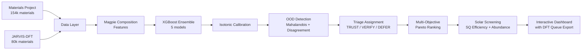

<p align="center">
  
</p>

<h1 align="center">MatScreen</h1>

<p align="center">
  Reliability-first triage for solar cell absorber discovery.
  <br>
  Don't trust predictions. Triage them.
</p>

<p align="center">
  <a href="#what-it-does">What It Does</a> &middot;
  <a href="#demo">Demo</a> &middot;
  <a href="#quickstart">Quickstart</a> &middot;
  <a href="#how-it-works">How It Works</a> &middot;
  <a href="#why-triage">Why Triage</a>
</p>

## What It Does

MatScreen screens 230,000+ known inorganic materials and tells you which solar absorber candidates to **trust**, which to **verify with DFT**, and which to **defer entirely**. Every prediction comes with calibrated confidence intervals and an honest assessment of whether the material is within the model's domain.

```
matscreen train run --target bandgap
matscreen screen run --bandgap 1.0:1.8 --max-ehull 0.05 --top 20
```

```
Triage Summary
┌────────┬───────┐
│ Label  │ Count │
├────────┼───────┤
│ TRUST  │    8  │
│ VERIFY │    7  │
│ DEFER  │    5  │
└────────┴───────┘

Top 20 candidates:
  TRUST  GaAs (SQ: 32.7%, Eg: 1.42 eV, std: 0.06)
  TRUST  CdTe (SQ: 30.8%, Eg: 1.50 eV, std: 0.07)
  VERIFY CuInSe2 (SQ: 28.1%, Eg: 1.04 eV, std: 0.14)
  DEFER  MAPbI3 (SQ: 33.1%, Eg: 1.55 eV, std: 0.31)
```

## Demo

https://github.com/user-attachments/assets/0fdeb153-4603-4880-9e57-51fd6dd68ce6

## Quickstart

```bash
pip install -e .
matscreen data fetch
matscreen train run --target bandgap
matscreen screen run --bandgap 1.0:1.8 --max-ehull 0.05 --top 20 --export-dft-queue
matscreen evaluate run
```

The `--export-dft-queue` flag writes VERIFY materials to `results/dft_queue.csv` for direct import into your simulation workflow.

## Architecture



## How It Works

1. **Data ingestion.** Fetches crystal structures and DFT-computed properties from Materials Project and JARVIS. Computes Magpie composition features (132 descriptors per material).

2. **Ensemble prediction.** Five XGBoost models trained with different random seeds predict band gap for each material. Ensemble disagreement provides raw uncertainty estimates.

3. **Calibration.** Raw ensemble standard deviation is recalibrated using isotonic regression on a held-out calibration set. The result: 90% confidence intervals that genuinely contain the truth approximately 90% of the time.

4. **OOD detection.** Materials outside the model's training domain are flagged using two signals: Mahalanobis distance in PCA-reduced feature space, and ensemble disagreement exceeding 3x the training median. Either signal triggers a DEFER label.

5. **Triage assignment.** Every material gets one of three labels:
   - **TRUST** (calibrated std below 0.10 eV, in-domain): act on this prediction directly
   - **VERIFY** (std 0.10 to 0.25 eV, in-domain): schedule a DFT calculation to confirm
   - **DEFER** (OOD or std above 0.25 eV): do not act without simulation

6. **Solar screening.** Candidates are ranked using multi-objective Pareto sorting across Shockley-Queisser efficiency, thermodynamic stability, prediction confidence, and element abundance. Toxic and supply-critical elements are flagged.

## Why Triage

Most materials screening tools show you a ranked list and maybe an uncertainty bar. That tells you how the model feels. It does not tell you what to do.

The problem: random train/test splits overstate ML performance. Out-of-distribution predictions look confident but are wrong. Coloured confidence badges create false trust.

MatScreen's approach:
- **Calibrated coverage**: intervals are validated with reliability diagrams and miscalibration area metrics
- **Domain refusal**: the model explicitly flags materials it cannot reliably predict, rather than guessing confidently
- **Action-oriented labels**: TRUST/VERIFY/DEFER tells a scientist what to do next, not just how uncertain the model is
- **Measured ROI**: compare triage-guided selection against naive top-k ranking to quantify how many DFT simulations you avoid

## Evaluation

Forward model performance validated on held-out test sets with fixed random splits.

| Property | Samples | Metric |
|----------|---------|--------|
| Band gap (eV) | 230,000+ | MAE, RMSE, miscalibration area |

Uncertainty calibration validated with reliability diagrams per chemistry family (oxides, chalcogenides, pnictides, halides).

```bash
matscreen evaluate run
```

## Limitations

- v1 focuses on solar cell absorbers. Other applications (LED, thermoelectric, wide-gap semiconductor) are planned for later verticals.
- Band gap predictions use PBE DFT values from training data, which systematically underestimate experimental band gaps by approximately 40 to 50%.
- This is retrieval-based screening over known materials, not generative design of novel structures.
- Synthesisability is not modelled. TRUST materials still require expert judgement before experimental follow-up.
- XGBoost on composition features is the v1 model. ALIGNN (graph neural network on crystal structures) is planned for v2 via the existing ForwardModel protocol.

## Acknowledgements

Built on data from [Materials Project](https://materialsproject.org/) and [JARVIS](https://jarvis.nist.gov/). Composition features via [matminer](https://hackingmaterials.lbl.gov/matminer/).
