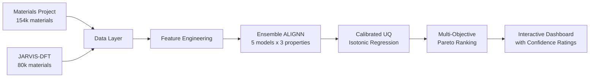

<p align="center">
  
</p>

<h1 align="center">MatScreen</h1>

<p align="center">
  Uncertainty-aware materials screening with calibrated confidence intervals.
</p>

<p align="center">
  <a href="#quickstart">Quickstart</a> &middot;
  <a href="#demo">Demo</a> &middot;
  <a href="#how-it-works">How It Works</a> &middot;
  <a href="#evaluation">Evaluation</a>
</p>

MatScreen takes target material properties as input, screens ~230,000 known inorganic materials from public databases, and returns a Pareto-ranked shortlist with calibrated uncertainty estimates.

## Demo

https://github.com/michaelmillar/matscreen/releases/download/v0.1.0/matscreen_demo.mp4

> Select an application (solar cell, LED, thermoelectric), and MatScreen screens 230,000 materials, ranks candidates by suitability, and shows calibrated confidence for every prediction. Green = high confidence. Red = verify with simulation.

## Quickstart

```bash
pip install -e .
matscreen data fetch
matscreen train run --model alignn --target bandgap
matscreen screen run --bandgap 1.0:1.5 --max-ehull 0.1 --top 20
matscreen report run --format html
```

## Architecture



## How It Works

1. **Data ingestion.** Fetches crystal structures and DFT-computed properties from Materials Project and JARVIS

2. **Forward prediction.** Ensemble of 5 ALIGNN models predicts band gap, formation energy, and bulk modulus for each material

3. **Uncertainty quantification.** Deep ensemble disagreement, recalibrated with isotonic regression so confidence intervals are honest

4. **Multi-objective screening.** Non-dominated Pareto sorting ranks materials across competing objectives (band gap vs stability vs confidence)

5. **Recommendations.** Interactive dashboard with confidence ratings (HIGH / MODERATE / LOW), radar charts, and property landscape visualisations

## Features

**Application presets.** Select "Solar Cell Absorber", "LED / Display", "Wide-Gap Semiconductor", or "Thermoelectric" and the system configures appropriate band gap ranges and stability thresholds automatically.

**Confidence ratings.** Every prediction gets an honest confidence label based on calibrated ensemble uncertainty. GREEN means the model has seen many similar materials. RED means the material is unusual and the prediction should be verified.

**Multi-objective ranking.** Pareto sorting balances band gap match, thermodynamic stability, and prediction confidence simultaneously. Single-property filtering misses these tradeoffs.

**Radar charts.** Five-dimensional property profiles let you compare candidates at a glance: band gap match, stability, confidence, mechanical strength, and formability.

## Evaluation

Forward model performance validated on [Matbench v0.1](https://matbench.materialsproject.org/) with fixed 5-fold cross-validation splits.

| Task | Property | Samples | Target MAE |
|------|----------|---------|-----------|
| matbench_mp_gap | Band gap (eV) | 106,113 | < 0.25 eV |
| matbench_mp_e_form | Formation energy (eV/atom) | 132,752 | < 0.04 |
| matbench_expt_gap | Experimental band gap (eV) | 4,604 | < 0.45 eV |

Uncertainty calibration validated with reliability diagrams and miscalibration area metrics.

Scientific validation via smell tests on known materials (GaAs, CdTe for solar absorbers).

## Limitations

- Band gap predictions use PBE DFT values, which systematically underestimate experimental band gaps by ~40 to 50%. JARVIS TBmBJ gaps are more accurate but available for fewer materials. The DFT functional is labelled for each prediction.
- This is retrieval-based screening over known materials, not generative design of novel structures.
- Synthesisability is not modelled. Screening results require expert judgement before experimental follow-up.

## Acknowledgements

Built on data from [Materials Project](https://materialsproject.org/), [JARVIS](https://jarvis.nist.gov/), and models from [ALIGNN](https://github.com/usnistgov/alignn). Benchmarked with [Matbench](https://matbench.materialsproject.org/).
